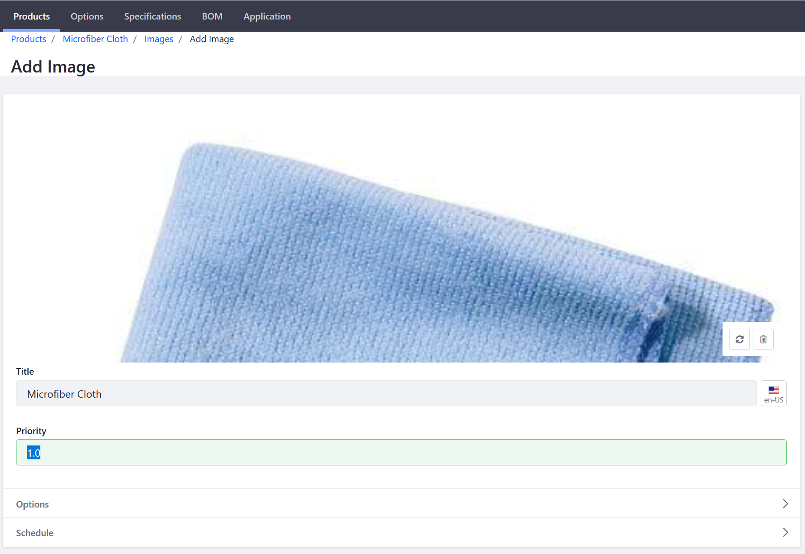
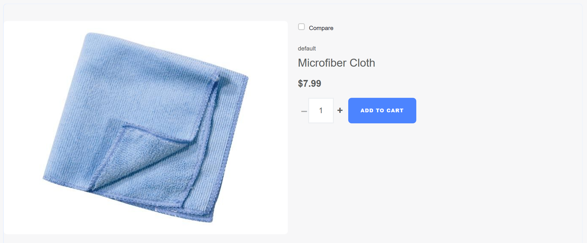
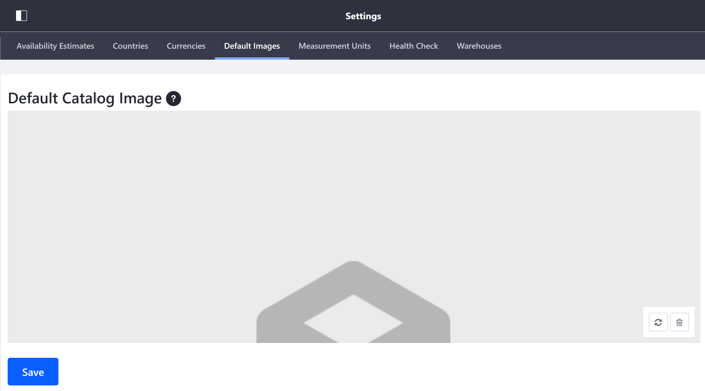

# Product Images

Adding a product image helps potential customers view the product looks like. Viewing a product's image ensures that customers know what they are buying and at the same increases the likelihood of a sale. This image will be used for all product variants (all SKUs).

This article documents how to add images to a product.

1. Navigate to the _Control Panel_ → _Commerce_ → _Products_.
1. Click on a product (in this example, _Microfiber Cloth_).
1. Click the _Images_ sub-tab.
1. Click the (+) button to add a Product Image.
1. Drag and Drop or click _Select File_ to insert an image.
1. Enter a title: _Microfiber Cloth_.
1. Set a priority: _1.0_.

    

1. Click _Publish_.

The new product image has been added to the product. To view the image in the catalog, go to the store site and then search for _Microfiber Cloth_. 
    

## Additional Information

**Note 1**: that this is not the same as the __Default Catalog Image__. The __Default Catalog Image__ is the image displayed if a product does not have its own product image.

   

