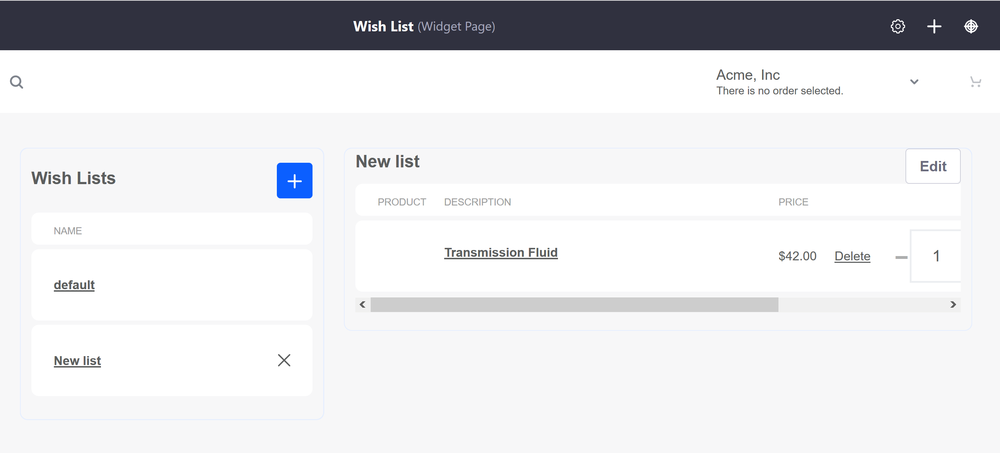

# Wish List Page

The Wish List Page is the page where buyers can create and view multiple lists that tracks all the items they would like in the future. Usually, the Wish List Page contains the _Wish Lists_ and _Wish List Contents_ widgets; as the names suggest, the first widget tracks all the created lists and the second tracks the contents of the highlighted list. Note that all wish lists are **site** specific; if a Liferay Commerce instance has more than one store site, wish lists are not transferred or saved acrossed sites.

One way to create a Wish List Page is to deploy the widgets to an existing page. For example, after using the Minium Accelerator to create the sample _Catalog Page_, an administrator can deploy the two widgets to the page.

Alternately, store administrators can use the site Navigation Menu to add a new page. This alternative is a cleaner, uncluttered page design but retains the full functionality.

Once the page has been created, a Wish List page might look like this:

