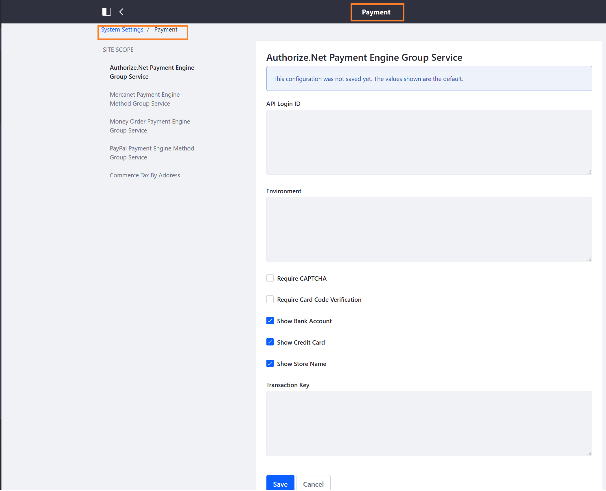

# Liferay Commerce Control Panel

This article documents all of the available Liferay Commerce settings in the _Control Panel_. Some settings are global settings which affect the entire Liferay Commerce instance while others affect a particular store site.

## Account Settings

Navigate to the _Control Panel_ → _User_ → _Accounts_. These settings apply to business and personal accounts.

### Accounts

See the [Introduction to Accounts](../../customers/account-management/introduction-to-accounts/README.md) and [Creating a New Account](../../customers/account-management/creating-a-new-account/README.md) articles for more information.

### Account Groups

Navigate to the _Control Panel_ → _User_ → _Account Groups_. These settings apply to account groups.

## Global Site Settings

Navigate to the _Control Panel_ → _Commerce_. These settings apply across the store sites.

### Channels

 Channels are a tool to filter products which can be displayed on multiple sites and are managed here.

See the [Managing Channels](../../catalog/creating-and-managing-products/-managing-channels/README.md) article to begin creating channels.

### Catalogs

Catalogs are created and managed on this menu.

### Products

Products are created and managed on this menu.

### Price Lists

[Price Lists](../../catalog/managing-price/price-lists/creating-a-price-list/README.md) are created and managed on this menu. Managers can change the price of a product accordingly.

### Discounts

Discounts are created and managed on this menu. To start creating discounts, see [Adding Discounts by Product](../../marketing/promotions/adding-discounts-by-product/README.md) and [Adding Discounts to the Subtotal](../../marketing/promotions/adding-discounts-to-the-subtotal/README.md)

### Orders

The Orders tab tracks orders through their life cycle from open to transmission to an ERP and then to completed.

### Shipments

The Shipments tab is where store managers create and manage shipments. Here, managers can update the shipment's status from Processing to Shipped to Delivered.

### Subscriptions

Subscriptions are for products that are shipped in several installments before the order is complete. This menu displays all active subscriptions.

### Settings

The Settings menu contains the following tabs:

* [Availability Estimates](../../catalog/managing-inventory/availability-estimates/README.md)
* [Countries](../country-options/README.md)
* [Currencies](../currencies/README.md)
* Default Images
* [Measurement Units](../../sales/shipping/measurement-units/README.md)
* Health Check
* [Warehouses](../../catalog/managing-inventory/warehouse-reference-guide/README.md)

## Site Specific Settings

Navigate to the _Control Panel_ → _Store Site_ → _Commerce_. These settings apply to the specific store site.

### Wish Lists

### Settings (Site)

The following settings are found here:

* Category Display Pages
* Health Check
* [Notifications](../../marketing/email-notifications/automating-store-emails-by-using-notification-templates/README.md)
* [Order Workflows](../../sales/order-management/order-workflows/README.md): Enable or disable buyer and seller pre-sales approval here.
* Order Fields
* [Payment Methods](../payments/README.md): Configure the third party payment system here.
* Product Display Pages
* [Shipping Methods](../../sales/shipping/README.md)
* [Site Types](../site-management-basics/sites-and-site-types/README.md)
* [Taxes](../../operations/taxes/README.md)

## System Settings

Navigate to the _Control Panel_ → _Configuration_ → _System Settings_.

These settings are for the system administrators and contain backend system settings. These settings do not affect buyers and the day to day operations of a store.

### Catalog

### Category.Inventory

### Orders (System Settings)

### Payment

### Pricing

### Shipping

### Users

### Wish Lists (System Settings)

