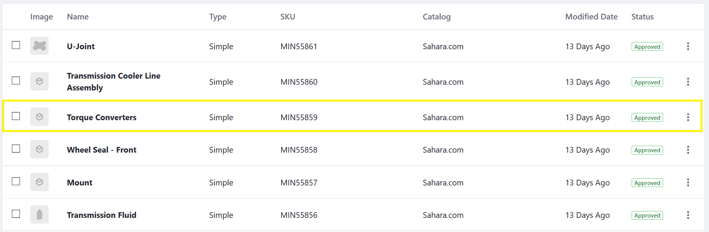

# Applying an Option Template to a Product

**An option** is a product feature that a buyer can select or specify. Before applying an option to a product, it is necessary to create an [option template](/../creating-option-templates/README.md) first.

Once you apply a template to a product, you can make any changes to the product’s option. These changes will not affect the option template or any other product.

To assign an option template to a product:

1. Navigate to the _Control Panel_ → _Commerce_ → _Products_.
1. Click the _Products_ tab.
1. Click on any product listed there. For example, if the Minium.com accelerator was used to create the site, one sample product is the _Torque Converters_.
     

1. Click _Torque Converters_.
1. Click the _Options_ subtab.
    

1. Click the (+) button to add an Option.
1. Check the box for _Package Quantity_.
1. Enter **1.0** in the _Priority_ field.
    

1. Click _Save_.

The _Package Quantity_ Option Template is now applied; when the product is displayed on the catalog page, buyers can select different quantities for Torque Converters. 

## Additional Information

Note that you can apply more than one option template per product and each option has its own unique display priority. In addition to _Package Quantity_ (created by default in the Minium accelerator), there is the _Color_ Option created in the [Options Template](/../creating-option-templates/README.md) article.
Furthemore, you can change the Option Values on this screen without having to change the template itself. 

1. Click the _Values_ link next to _Package Quantity_.
2. Click the (+) button to add a new value.
3. Enter the following:
    * **Name:** 60
    * **Priority:** 5.0
    * **Key:** (autogenerated)
4. Click _Save_. 
    

The new option for 60 has been added to the possible quantities a buyer can choose from.
