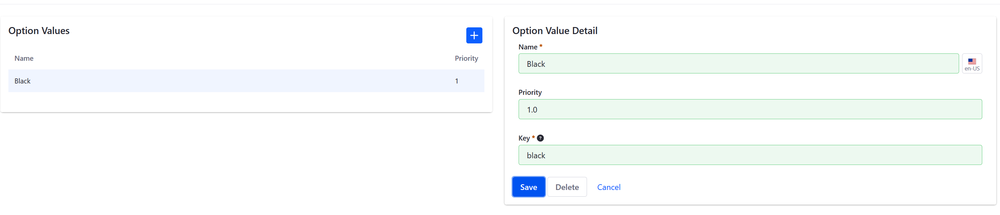

# Creating Option Templates

An option template can be applied to any product in the catalog. This makes it easy to apply frequently-used options to a large number of products. This article describes how to create an option template. Option Templates are created independently from a product so that changes to the template do not affect the product's description.

To create an option template:   

1. Navigate to the _Control Panel_ → _Commerce_ → _Product_.      
1. Click on the _Options_ tab. This displays a list of existing templates on the left of the page and the _Option Template Detail_ form on the right.     
1. Click the _(+) Add Option Template_ button.     
1. Enter the following:     
    * **Title**: _Color_.
    * **Description**: _Choice of colors_  
    * **Field Type**: _Select from List_
    * **Use in Faceted Navigation**: _Yes_ 
	* **Required**: _Yes_
	* **SKU Contributor:** _No_
	* **Key**: (automatically generated) 
    

1. Click _Save_. 

The _Color_ Option Template has been added and can be applied to all products.

Depending on the Field Type used in the template, you may need to create values for that option. In this example, _Select from List_ requires Option Values, such as the different product colors.

To add multiple Option Values:

1. Click the _Values_ link next to _Color_.    
1. Click the (+) Add Option Values button.    
1. Enter the following:    
    * **Name:** Black    
    * **Priority:** 1.0    
    * **Key:** (autogenerated from the _Name_ field)    
        

1. Click _Save_. 

_Black_ is now added to the Color options. To add more colors, repeat the steps and increment up the priority. For example, you can add _White_ and priority set as 2.0 followed by _Blue_ with priority 3.0, and so forth. Remember the priority field determines the order in which the options are displayed with the lowest values being displayed first.

## Additional Information
**Note 1**: When _Use in Faceted Navigation_ is switched to _Active_, this enable to allow search results to be filtered for this option.

**Note 2**: A SKU contributor can be assigned a unique price and other attributes for each variant via [SKUs](https://help.liferay.com/hc/en-us/articles/360017869972-SKUs-). If enabled, the option must have an SKU in order to be sold.

**Note 3**: The Key is a unique identifier for referring to this option programmatically. As this field is filled automatically, most users can safely leave it alone.
